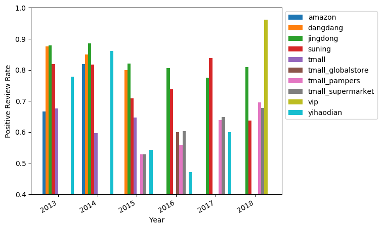

# NOTICE:
for the sake of the privacy of your datasets, I deleted from repo. Please copy it to "datasets" dir.

# Highlight:
- AlBERT works really good. Especially after good fine-tuning.
- Using Numpy mask array is a good and fast way to analyse cross-section data.

# Env requirement: 
- Python3 
- Tesorflow 1.13+ 
- Keras 2.3+

# 1. ModelTraining(overallSentiment.py):
## Main methods: DNN-ALBERT_tiny_zh_google + FineTune twice.
- FineTune 1st
    - source: https://github.com/bojone/bert4keras.git
    - ACC: 0.86 (for the test dataset)
- FineTune 2nd: 
    - Datasets: based on the predicted result by fineTune1 model, manually adjusted 1000 reviews's annotations.
    - ACC: 0.92 (for the test dataset)

# 2. Analysis(analyze.py):
## Main mathods:
- use mask array to select data and plot.
- use "jieba" package to analyze keywords of negtive reviews, and plot word cloud.
- deeper analyze: focus on "fake product" negtive reviews.

## Results:
#### Brand_Year-Positive_Review_Rate: 
shows that all the brands' positve review decline from 2013 to 2016, and then increase again till now.

#### Year-Brand_Positive-Review-Rate: 

#### Brand_Store-Positive_Review_Rate:
shows that store "vip" has the best positive reviews, and tmall the worst.

#### pampers_Store_Year-Positive_Review_Rate:
detail of pampers:

#### pampers_Year_Store-Positive_Review_Rate:
detail of pampers:

#### Check the details of negtive reviews(keywords analysis):
shows that "fake product" might be an important issue.

#### Brand-Store_Fake_Rate:
shows that the "fake product" issue has a peak at 2016, and is decreasing after that. Brand "merries" has the biggest problem with it.

#### pampers_Year_Store-Fake_Rate:
detail of pampers:

#### Fake_issure_excluded_Brand_Year-Positive_Review_Rate:
Comparing with the fake issue included one(first fig), the difference of positive reviews between brands, decreased:

comparing with the fake issue included one:

# Conclusions:
1. Bert/Albert is powerful!
2. "Fake product" should not be neglected when anaylzing reviews.

# More words and Next:
For the 1st time of doing a NLP project, I've paied too much time in Aspect-Based Sentiment Analysis tech review which leads to no time for further analysis of processed data.

More things to be done: conduct a thorough Aspect-Based Sentiment Analysis.
